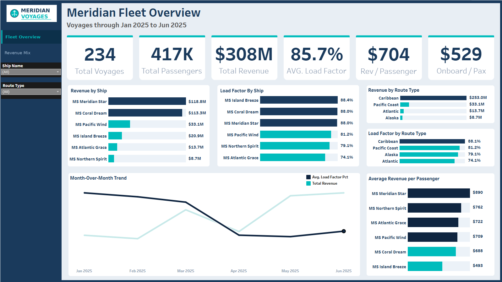
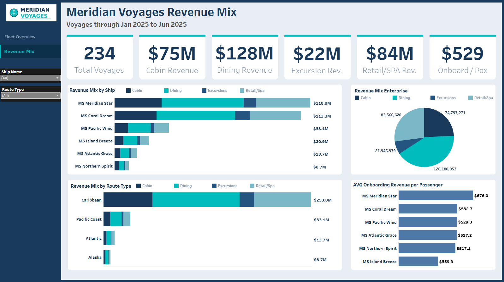

  

# Meridian Voyages Fleet Performance Analysis

 &nbsp;  &nbsp; 

---

## Background

<table border="0" cellpadding="12" cellspacing="0">
<tr>
<td width="140" valign="top"><strong>About Meridian Voyages</strong></td>
<td valign="top"><small>Meridian Voyages is a fictional US-based cruise line operating a fleet of six ships across four departure ports: Miami, Los Angeles, New York, and Seattle. The fleet covers four route types across ten sailing itineraries: Caribbean, Pacific Coast, Atlantic, and Alaska. Revenue flows from four streams: cabin bookings, onboard dining, shore excursions, and retail and spa.</small></td>
</tr>
<tr>
<td valign="top"><strong>The Ask</strong></td>
<td valign="top"><small>The Director of Revenue Operations needed a clear picture of fleet performance through the first half of 2025. Sailings had been inconsistent across ships and routes and leadership couldn't tell whether the gaps came from seasonal demand, route mix, or onboard spend patterns. I was tasked with cutting through the noise and telling them exactly where the fleet was winning, where it was leaving money on the table, and what was driving the difference.</small></td>
</tr>
<tr>
<td valign="top"><strong>Scope</strong></td>
<td valign="top"><small>The analysis focused on three questions: which ships and routes are actually profitable on a per-passenger basis, whether onboard spend is pulling its weight across the fleet, and what the booking window data reveals about pricing behavior. Data covers January through June 2025 across 234 voyages.</small></td>
</tr>
</table>

---

## Dashboard

> Please click on one of the images to navigate to Tableau dashboard

)

---

## Data

Five tables. Two dimension tables holding ship and route reference data, and three fact tables covering voyage-level records, individual cabin bookings, and onboard spend by revenue stream. All analysis was done in Oracle APEX SQL before connecting to Tableau.

| Table | What's in it |
|---|---|
| `dim_ships` | 6 ships with class, capacity, cabin count, crew, and home port |
| `dim_routes` | 10 routes with type, departure port, duration, and ports of call |
| `fact_voyages` | 234 H1 2025 sailings with load factor, passengers, and cabin counts |
| `fact_bookings` | Individual cabin booking records with cabin type, booking date, days before sail, and revenue |
| `fact_onboard_spend` | Voyage-level spend broken into dining, excursions, and retail/spa |

---

## Executive Summary

### Fleet Performance, H1 2025

**1. Strong headline numbers that hide a more complicated story**

The fleet completed 234 voyages in H1 2025, carried 417K passengers, and generated $308M in total revenue at an average load factor of 85.7%. On paper that looks healthy. But the per-ship and per-route breakdowns tell a different story about where that revenue is actually coming from and how efficiently it's being generated.

**2. Two ships are carrying the fleet**

MS Meridian Star and MS Coral Dream together account for $232M of the $308M total, roughly 75% of all revenue. Every other ship in the fleet is a distant third at best. That concentration isn't necessarily a problem, but it means the portfolio has very little cushion if either of those ships underperforms in H2.

**3. Load factor and revenue per passenger are telling two different stories**

MS Island Breeze has the highest load factor in the fleet at 88.4%, but the lowest revenue per passenger at $493, well below the fleet average of $704. It fills cabins but doesn't generate onboard spend. MS Meridian Star matches that load factor at 88.0% and generates $890 per passenger. Same occupancy, nearly double the yield. That gap is the central finding of this analysis.

**4. Load factor declined sharply heading into Q2**

January opened at 94.7%, the highest month in the dataset. By April it had dropped to 80.4% before partially recovering in May and June. Revenue followed the same pattern, falling from $45.4M in January to $46.6M in April before climbing to $59.7M in June. The partial recovery is encouraging but the Q1 to Q2 drop is worth watching as H2 planning begins.

---

## What the Data Showed

### Ship Performance

  

| Ship | Total Revenue | Load Factor | Rev / Passenger | Onboard / Pax |
|---|---|---|---|---|
| MS Meridian Star | $118.8M | 88.0% | $890 | $676 |
| MS Coral Dream | $113.3M | 88.0% | $689 | $533 |
| MS Pacific Wind | $33.1M | 81.2% | $709 | $529 |
| MS Island Breeze | $20.9M | 88.4% | $493 | $360 |
| MS Atlantic Grace | $13.7M | 74.1% | $723 | $527 |
| MS Northern Spirit | $8.7M | 79.1% | $762 | $517 |

The Meridian Star stands apart from every other ship. It generates $890 per passenger at the same 88% load factor as Island Breeze, which means the difference is almost entirely explained by onboard spend. Star passengers spend $676 per head beyond their cabin. Island Breeze passengers spend $360. That's not a minor gap, it's a fundamentally different guest profile or a fundamentally different onboard product.

MS Atlantic Grace is the load factor concern. At 74.1% it's the only ship meaningfully below the fleet average and it operates entirely on Atlantic routes, which are the softest in the portfolio. Whether that's a route issue or a ship positioning issue is worth investigating before H2.

---

### Route Performance

| Route Type | Total Revenue | Load Factor | Rev / Passenger |
|---|---|---|---|
| Caribbean | $253.0M | 88.1% | $697 |
| Pacific Coast | $33.1M | 81.2% | $709 |
| Atlantic | $13.7M | 74.1% | $723 |
| Alaska | $8.7M | 79.1% | $762 |

Caribbean routes dominate total revenue at $253M, which makes sense given that the two largest ships in the fleet run Caribbean itineraries year-round. But Alaska has the highest revenue per passenger at $762, nearly 10% above Caribbean on a per-head basis. Alaska routes run smaller ships on fewer sailings, so the absolute number stays low, but the per-passenger yield is the best in the fleet.

Atlantic routes are the weakest on load factor and the second highest on revenue per passenger. That combination suggests pricing may be keeping demand softer than it needs to be. Guests who do book Atlantic itineraries spend well. There just aren't enough of them.

---

### Revenue Mix

  

| Revenue Stream | H1 2025 Total | Share of Total |
|---|---|---|
| Dining Revenue | $128.2M | 41.6% |
| Retail / Spa Revenue | $83.6M | 27.1% |
| Cabin Revenue | $74.8M | 24.3% |
| Excursion Revenue | $21.9M | 7.1% |

The most notable thing about the revenue mix is that cabin bookings are only 24% of total revenue. Onboard spending is carrying the business. That's actually a good sign structurally since onboard revenue tends to carry better margins than cabin pricing, but it also means the fleet is highly exposed to anything that suppresses guest spending once they're on the ship.

Excursions are the smallest stream at $21.9M and only 7.1% of total revenue. On Alaska and Atlantic routes, where the destinations are the main draw, excursion revenue should be higher. That's the clearest underperforming line item in the mix.

MS Island Breeze's onboard spend per passenger of $360 compared to MS Meridian Star's $676 is the starkest illustration of the problem. Island Breeze isn't just generating less per passenger in absolute terms, its onboard spend is nearly half of what the Star produces.

---

### Month-over-Month Trends

| Month | Avg Load Factor | Total Revenue |
|---|---|---|
| January | 94.7% | $45.4M |
| February | 93.4% | $44.2M |
| March | 91.6% | $54.0M |
| April | 80.4% | $46.6M |
| May | 79.9% | $58.7M |
| June | 81.8% | $59.7M |

January and February are the strongest load factor months, which tracks with Caribbean peak season driving the fleet's busiest ships at near-full occupancy. The 14-point drop from January to April is the sharpest decline in the dataset and coincides with Atlantic and Alaska routes coming online, both of which operate at lower load factors than Caribbean.

Revenue actually increases from April through June despite the lower load factors, which means larger ships and longer itineraries are compensating for the occupancy softness with higher per-voyage revenue. The fleet is not in trouble heading into H2, but the load factor recovery from April's 80.4% low was only partial by June.

---

## Recommendations

**Investigate what Island Breeze is doing differently.** It fills to 88.4% every month, which proves demand isn't the issue. Something about the onboard product, the itineraries it runs, or the guest segment it attracts is suppressing spend to $360 per passenger. Closing even half the gap to the fleet average would meaningfully move the overall revenue number.

**Look harder at excursion revenue.** At 7.1% of total revenue it's the smallest stream and the most underdeveloped. Alaska and Atlantic passengers are boarding with genuine interest in the destinations. A stronger excursion program on those routes, better curated and better marketed onboard, would move that number.

**Be deliberate about Atlantic route pricing.** Load factor is 74.1% but revenue per passenger is $723, the second highest in the portfolio. Guests who book Atlantic sailings spend well. The problem is there aren't enough of them. A targeted pricing review or promotional push specifically for Atlantic itineraries could improve occupancy without sacrificing the yield that makes those routes worth running.

**Watch the Q1 to Q2 load factor drop in the H2 data.** This year it fell 14 points between January and April. If the same pattern holds in H2, the recovery through Q4 is what matters. The partial rebound to 81.8% in June is a reasonable starting point but it hasn't returned to Q1 levels.

---
